<div align="center">

# Con la tuya, contribuyente

**Every peso the Uruguayan state spends, traceable.**

A transparency platform over Uruguay's public-procurement open data (OCDS). It covers ~2.17M contract
records since 2002, 42,510 suppliers and 397 buying agencies. It publishes them as a dashboard, a
public API and an MCP server.

[**Live site → conlatuya.checkleaked.cc**](https://conlatuya.checkleaked.cc) ·
[API docs](https://conlatuya.checkleaked.cc/docs) ·
[OpenAPI](https://conlatuya.checkleaked.cc/openapi.json) ·
[llms.txt](https://conlatuya.checkleaked.cc/llms.txt)

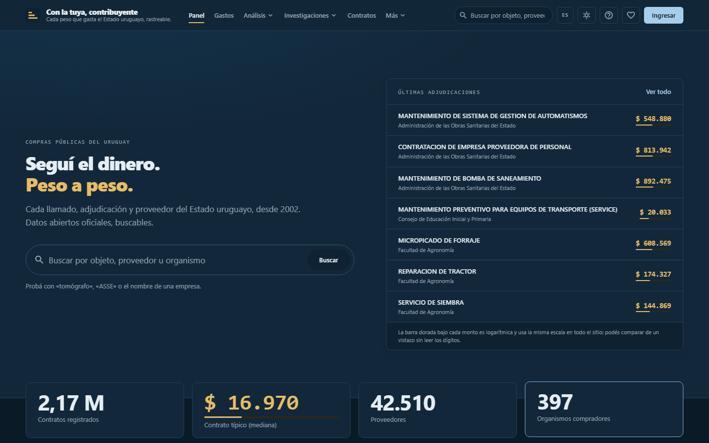

</div>

---

## Table of contents

- [What this is](#what-this-is)
- [Feature tour](#feature-tour)
- [Site map](#site-map)
- [Repository map](#repository-map)
- [Quick start](#quick-start)
- [The data pipeline](#the-data-pipeline)
- [Public API, webhooks and MCP](#public-api-webhooks-and-mcp)
- [Deployment](#deployment)
- [Testing](#testing)
- [Documentation index](#documentation-index)
- [For AI agents](#for-ai-agents)
- [License](#license)

---

## What this is

Uruguay publishes its procurement data as [OCDS](https://standard.open-contracting.org/) releases on
`catalogodatos.gub.uy` and `comprasestatales.gub.uy`. The raw feed is open, but you cannot use it as it
comes. It ships multi-GB yearly ZIPs. Amounts need multi-currency normalisation. Corrections never
rewrite the record they correct. Nothing answers "is this price normal?".

This repo turns that feed into a record a journalist, a supplier or a citizen can use:

| | |
|---|---|
| **Ingest** | Streams the yearly OCDS ZIPs and the daily RSS feed into MongoDB. Normalises every award into a comparable UYU amount with historical BCU rates (UYI, USD). |
| **Reconcile** | Folds award-amendment releases back into the base award. The government never rewrites the original, so uncorrected totals are wildly inflated. |
| **Screen** | Compares every award line against a 36-month robust (log-median) price reference for the same catalogue article, currency and unit, and flags the outliers. A second-stage LLM triage then separates real overprice signals from data-loading errors. |
| **Cross-reference** | Joins the SICE article catalogue, the MIEM industrial registry (DEI), governing-party mandates and documented corruption cases against the same contract IDs. |
| **Publish** | A Nuxt 3 dashboard, a versioned public REST API with API keys and webhooks, and an MCP server, so an LLM can query it directly. |
| **Alert** | Suppliers subscribe to open tenders by rubro or keyword. Alerts fan out over email, web push, Telegram and an in-app inbox. |

Every figure comes from official open data and links back to its source record on
`comprasestatales.gub.uy`.

---

## Feature tour

### Search and browse the whole spending record

Contracts, suppliers, buying agencies and products each get a filterable index and a detail page. One
logarithmic gold bar shows every amount site-wide, so you compare magnitudes without reading digits.
The rule lives in [app/DESIGN.md](app/DESIGN.md).

| Contracts | Contract detail |
|---|---|
| 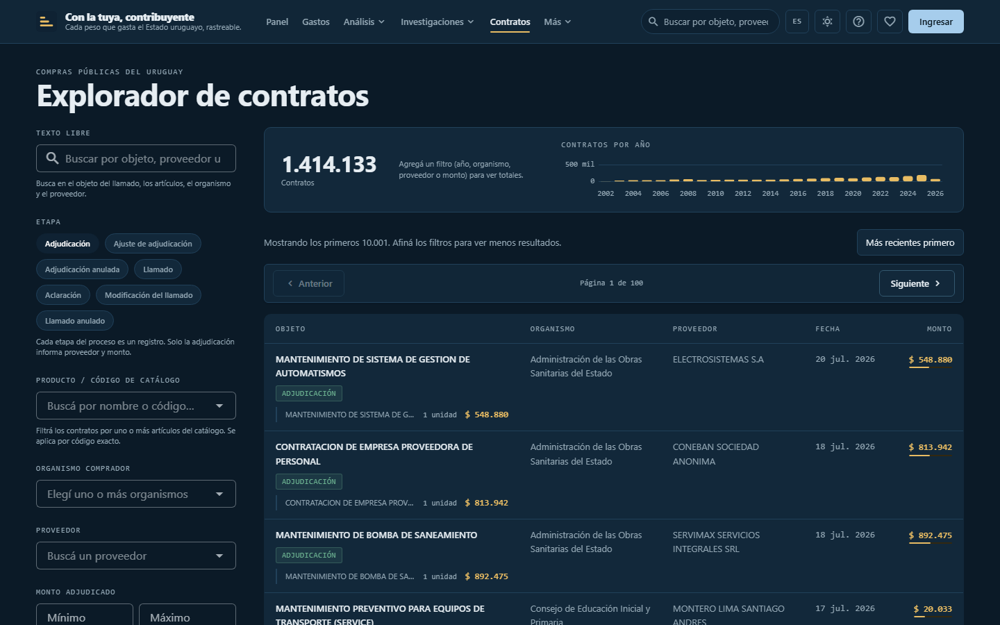 | 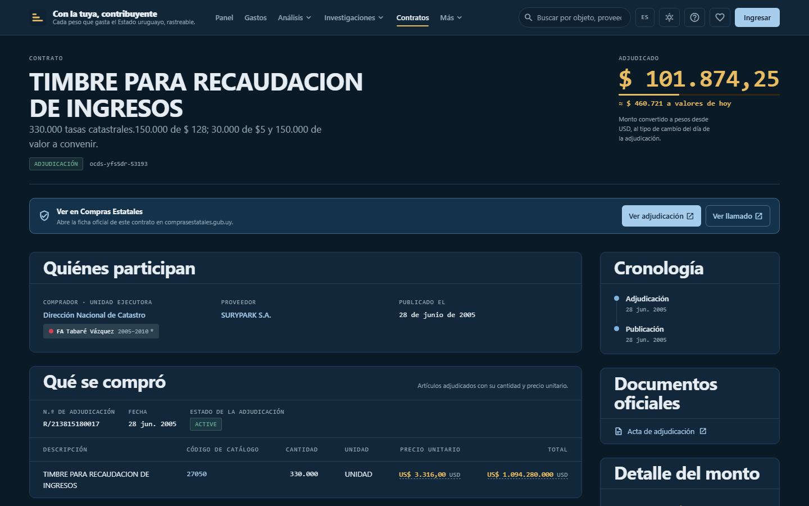 |

| Suppliers | Supplier profile |
|---|---|
| 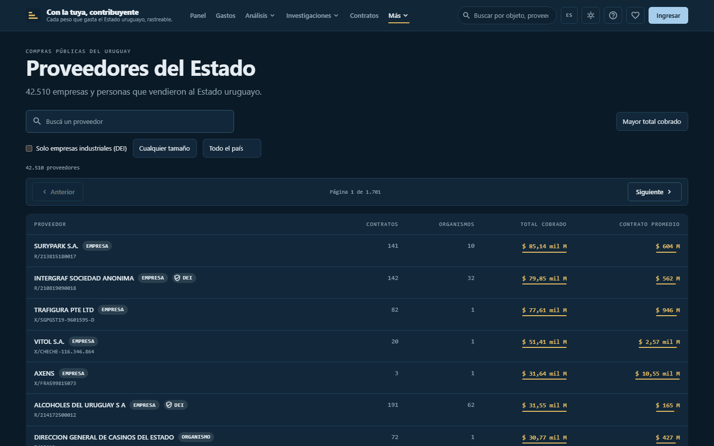 | 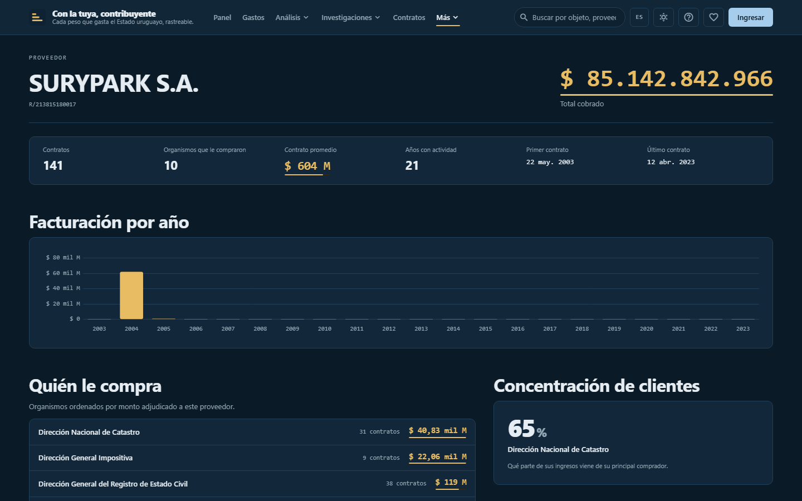 |

| Buying agencies | Products / catalogue |
|---|---|
| 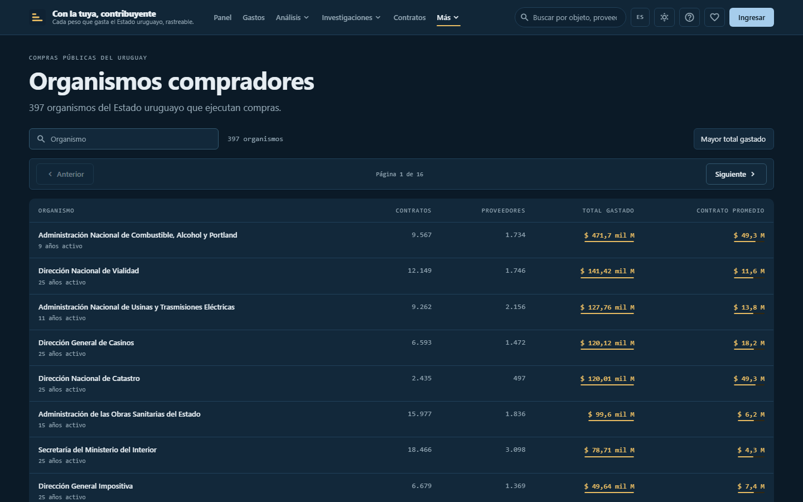 | 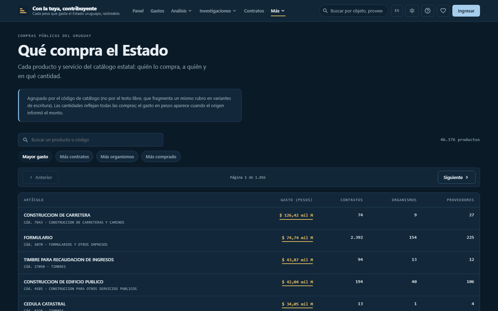 |

### Price-anomaly screening

A flag is **not an accusation**. The page says so and explains the method inline. You filter by
severity, by LLM triage verdict (`sin explicación`, `a revisar`, `con explicación`) and by error type.

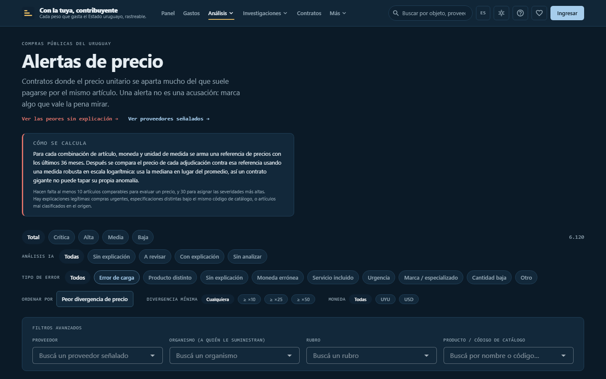

A dedicated page separates *data-loading errors* from real signals. Any visitor reports a record that
disagrees with the official page:

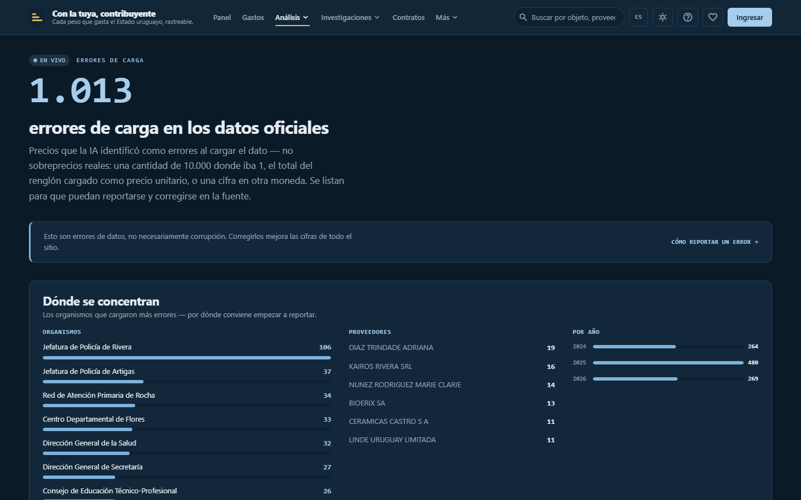

### Analytics

| Spending by governing party (SVG choropleth) | Spending by organism group |
|---|---|
| 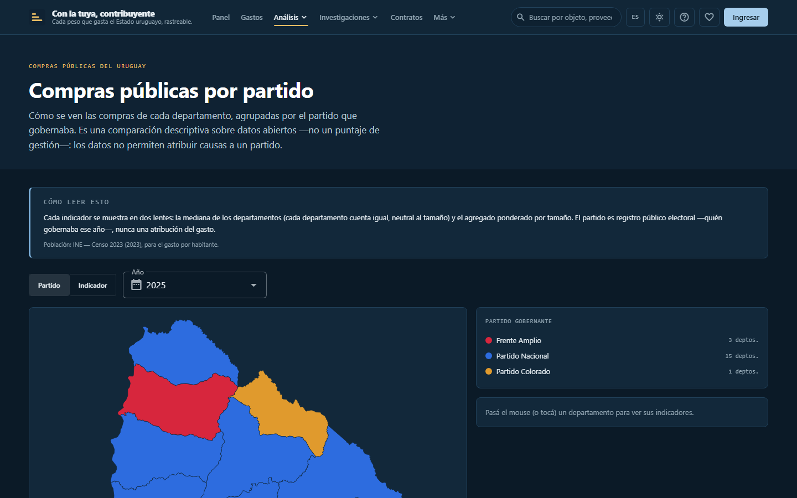 | 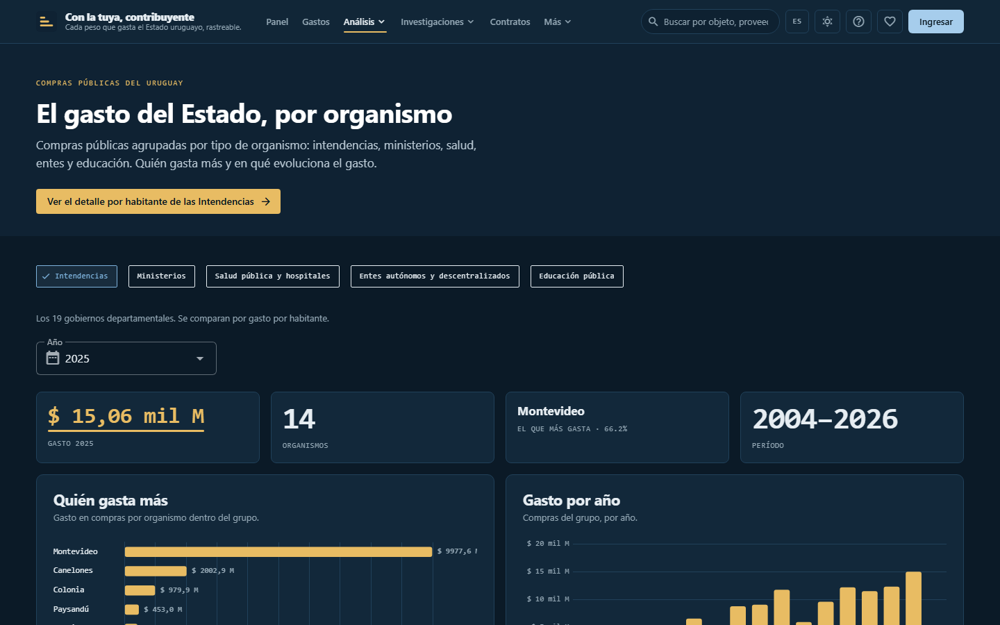 |

The section also holds a departmental map, an analytics hub and per-mandate attribution: which
president or intendente governed the agency in the year of the spending.

### Investigations and documented cases

Long-form investigations run on the same database. *Curros en evidencia* collects cases from the press,
audit bodies and the courts. Each case carries its sources and legal status, cross-checked one by one
against the official data.

| Investigations | Curros |
|---|---|
| 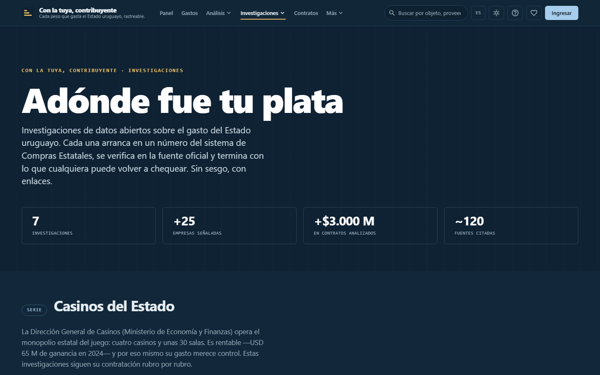 | 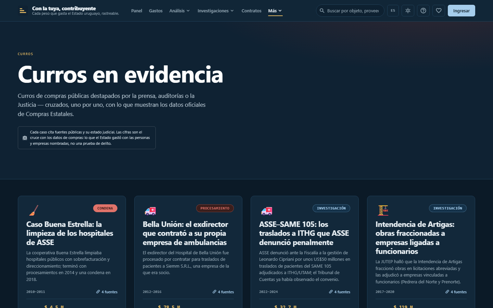 |

### Open tenders + bid intelligence (for suppliers)

Active calls show their pliegos, items and deadlines. A bid estimate answers "how much should I bid to
win?". It uses the unit prices the state awarded before in the same rubro, unit-matched and expressed
as percentiles.

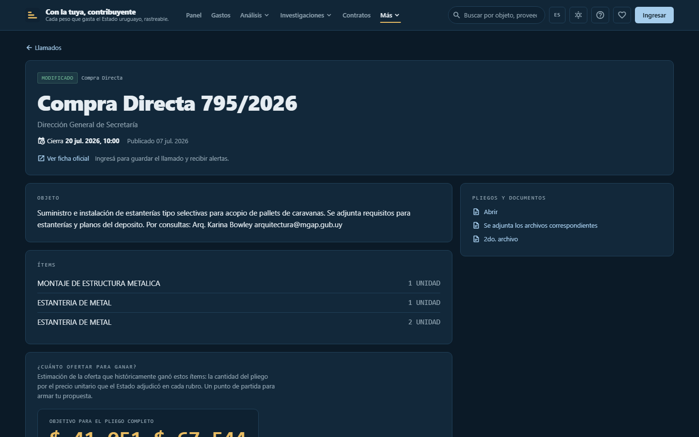

Save a call, or subscribe to a rubro or keyword watch to receive the alerts.

### Developer platform

Self-service API keys, interactive docs, webhooks and an official MCP server. Details:
[Public API, webhooks and MCP](#public-api-webhooks-and-mcp).

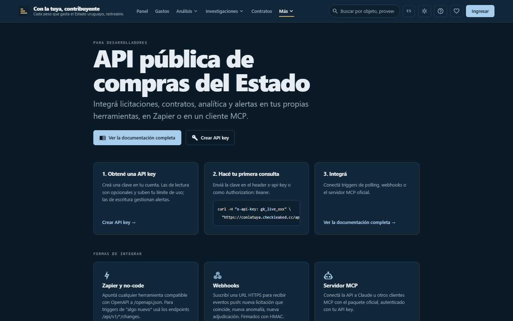

### Mobile

The whole site is responsive. You install it as a PWA.

<div align="center">
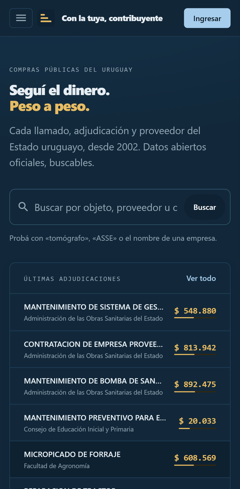
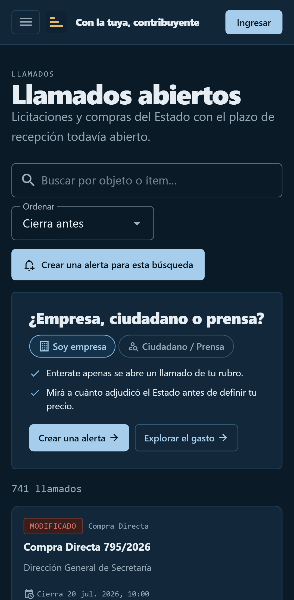
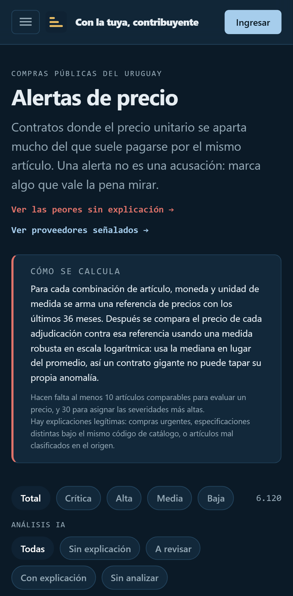
</div>

> The screenshots come from the live site. The full set (28 views) is in
> [docs/screenshots/](docs/screenshots/). Refresh it with
> `node scripts/capture-screenshots.mjs`.

---

## Site map

Every link below points at the live site, [conlatuya.checkleaked.cc](https://conlatuya.checkleaked.cc).
Spanish is the default locale and carries no prefix. Every page has an English mirror under `/en/` —
`/en/contracts`, `/en/analytics/partidos`, and so on. The navigation tree these tables follow is
declared once in [app/utils/nav.ts](app/utils/nav.ts).

### Start here

| Page | What it answers |
|---|---|
| [Home](https://conlatuya.checkleaked.cc/) | The overview: totals, latest records, entry points |
| [Spending](https://conlatuya.checkleaked.cc/gastos) | Where the money went, for a reader with no case in mind |
| [How it works](https://conlatuya.checkleaked.cc/about) | Sources, method and what a figure on this site means |

### Explore the record

| Page | What it holds |
|---|---|
| [Contracts](https://conlatuya.checkleaked.cc/contracts) | Every award, filterable; each one links back to its official record |
| [Suppliers](https://conlatuya.checkleaked.cc/suppliers) | 42,510 firms that sell to the state, with their profile and history |
| [Agencies](https://conlatuya.checkleaked.cc/buyers) | 397 buying agencies |
| [Products](https://conlatuya.checkleaked.cc/products) | The SICE article catalogue: 91k articles over a 5-level rubro tree |
| [Open calls](https://conlatuya.checkleaked.cc/llamados) | Active tenders, their pliegos, items, deadlines and bid estimate |

### What to check — signals and flags

| Page | What it shows |
|---|---|
| [What to check](https://conlatuya.checkleaked.cc/analytics) | The hub for every screening view below |
| [Management signals](https://conlatuya.checkleaked.cc/analytics/senales) | Five indicators per agency, scored by percentile, not by a fixed threshold |
| [Competition](https://conlatuya.checkleaked.cc/analytics/competencia) | Single-bidder rate and firms that bid from the same address |
| [Court of Accounts](https://conlatuya.checkleaked.cc/analytics/tribunal-cuentas) | Contracts named in *Tribunal de Cuentas* resolutions |
| [Undeclared assets](https://conlatuya.checkleaked.cc/analytics/omisos) | Officials who never filed the asset declaration the law requires |
| [Sanctioned firms](https://conlatuya.checkleaked.cc/analytics/sanciones) | UDECO consumer sanctions crossed against purchase orders |
| [Flags](https://conlatuya.checkleaked.cc/analytics/anomalies) | The price-outlier screening, filterable by severity and LLM verdict |
| [Unexplained alerts](https://conlatuya.checkleaked.cc/analytics/unexplained) | The flags the LLM triage could not explain away |
| [Data-load errors](https://conlatuya.checkleaked.cc/analytics/errores-carga) | Records that disagree with the official page; any visitor reports one |
| [Flagged suppliers](https://conlatuya.checkleaked.cc/analytics/proveedores-anomalias) | The same screening rolled up per supplier |
| [Suppliers with errors](https://conlatuya.checkleaked.cc/analytics/proveedores-errores-carga) | Load errors rolled up per supplier |
| [Alerts RSS](https://conlatuya.checkleaked.cc/analytics/rss-anomalias) | The flag feed as RSS |

### Spending X-ray

| Page | Cut |
|---|---|
| [Spending by agency](https://conlatuya.checkleaked.cc/analytics/organismos) | Grouped by type — Intendencias, Ministerios, Salud, Entes, Educación |
| [Intendencias](https://conlatuya.checkleaked.cc/analytics/intendencias) | The 19 departmental governments compared |
| [Spending blocks](https://conlatuya.checkleaked.cc/analytics/mapa) | The whole budget as one proportional grid |
| [Procurement by party](https://conlatuya.checkleaked.cc/analytics/partidos) | Attributed to the party governing the agency that year, on an SVG choropleth |
| [Gender spending](https://conlatuya.checkleaked.cc/analytics/genero) | Spending recovered by subject, since the feed has no policy-area field |
| [State advertising](https://conlatuya.checkleaked.cc/pauta) | What the state pays media |

### Trends

| Page | Window |
|---|---|
| [Today's agenda](https://conlatuya.checkleaked.cc/analytics/agenda) | What entered the register today, plus the dated official indicators |
| [Spending over time](https://conlatuya.checkleaked.cc/analytics/evolucion-gasto) | Why the yearly total moved: inflation, coverage or real change |
| [Statistics](https://conlatuya.checkleaked.cc/estadisticas) | The corpus in numbers |
| [Upcoming tenders](https://conlatuya.checkleaked.cc/analytics/anticipacion) | Calls likely to reopen, from the PAC plus purchase recurrence |
| [Opinion polls](https://conlatuya.checkleaked.cc/analytics/encuestas) | Third-party measurements, each with its own ficha técnica |
| [Uruguayan YouTube channels](https://conlatuya.checkleaked.cc/canales-youtube) | The verified directory, and what each channel publishes |
| [Parliament](https://conlatuya.checkleaked.cc/parlamento) | What was said in each session, in plain language |

### Investigations

| Page | Subject |
|---|---|
| [Investigations](https://conlatuya.checkleaked.cc/investigaciones) | Index of every long-form piece |
| [Case files](https://conlatuya.checkleaked.cc/investigaciones/casos) | Over a thousand files, grouped by theme — browse here first |
| [Cases in evidence](https://conlatuya.checkleaked.cc/curros) | Cases with a judicial process, each with sources and legal status |
| [Spending by event](https://conlatuya.checkleaked.cc/recopilatorios) | What one event cost, assembled from the contracts behind it |
| [Weekly briefing](https://conlatuya.checkleaked.cc/blog) | The week in the register |

Individual pieces:

| | |
|---|---|
| [Our own findings](https://conlatuya.checkleaked.cc/investigaciones/hallazgos) | [State casinos](https://conlatuya.checkleaked.cc/investigaciones/casinos) |
| [Casino comps](https://conlatuya.checkleaked.cc/investigaciones/casinos-cortesia) | [Montevideo City Hall](https://conlatuya.checkleaked.cc/investigaciones/intendencia-montevideo) |
| [TV Ciudad](https://conlatuya.checkleaked.cc/investigaciones/tv-ciudad) | [State monopolies](https://conlatuya.checkleaked.cc/investigaciones/monopolios) |
| [Flagged companies](https://conlatuya.checkleaked.cc/investigaciones/empresas-senaladas) | [ASSE: ambulances](https://conlatuya.checkleaked.cc/investigaciones/asse-ambulancias) |
| [Saturno meatpacker](https://conlatuya.checkleaked.cc/investigaciones/frigorifico-saturno) | [Apparent competition](https://conlatuya.checkleaked.cc/investigaciones/competencia-aparente) |
| [ANTEL crews](https://conlatuya.checkleaked.cc/investigaciones/antel-cuadrillas) | [Google's data centre](https://conlatuya.checkleaked.cc/investigaciones/datacenter-google) |
| [Construction agreement](https://conlatuya.checkleaked.cc/investigaciones/sunca) | [Gender spending](https://conlatuya.checkleaked.cc/investigaciones/gasto-en-genero) |
| [The State messages](https://conlatuya.checkleaked.cc/investigaciones/mensajes-del-estado) | [Are we getting worse?](https://conlatuya.checkleaked.cc/investigaciones/mejor-o-peor) |
| [The FA document, fact-checked](https://conlatuya.checkleaked.cc/investigaciones/documento-fa) | [Promoted housing](https://conlatuya.checkleaked.cc/investigaciones/vivienda-promovida) |
| [Private channels and advertising](https://conlatuya.checkleaked.cc/investigaciones/canales-privados) | [Seven purchases against suicide](https://conlatuya.checkleaked.cc/investigaciones/suicidios) |
| [Suicide: the State's resources](https://conlatuya.checkleaked.cc/investigaciones/suicidios-recursos) | |

### Contact directories

| Page | Who is in it |
|---|---|
| [Provider contacts](https://conlatuya.checkleaked.cc/proveedores/contactos) | Firms that already sell to the state, with a badge per data source |
| [Agency contacts](https://conlatuya.checkleaked.cc/contactos) | The purchasing desk of each buying agency |

### Developers

| Resource | |
|---|---|
| [Developers](https://conlatuya.checkleaked.cc/developers) | API keys, quotas, webhooks and the MCP server |
| [API docs](https://conlatuya.checkleaked.cc/docs) | The `/api/v1` reference, rendered with Scalar |
| [openapi.json](https://conlatuya.checkleaked.cc/openapi.json) | The spec itself |
| [llms.txt](https://conlatuya.checkleaked.cc/llms.txt) | Site summary for crawlers and LLMs |
| [sitemap_index.xml](https://conlatuya.checkleaked.cc/sitemap_index.xml) | Every indexable URL |

### Your account

These need a sign-in and redirect to [/login](https://conlatuya.checkleaked.cc/login) otherwise.
Registration is at [/registro](https://conlatuya.checkleaked.cc/registro).

| Page | |
|---|---|
| [Dashboard](https://conlatuya.checkleaked.cc/app) | Saved calls and suppliers |
| [Alerts](https://conlatuya.checkleaked.cc/app/alertas) | Rubro and keyword watches, and the channel each one uses |
| [Notifications](https://conlatuya.checkleaked.cc/app/notificaciones) | The in-app inbox |
| [Calendar](https://conlatuya.checkleaked.cc/app/calendario) | Deadlines of the calls you follow |
| [API keys](https://conlatuya.checkleaked.cc/app/api-keys) | Create and revoke `gk_live_` keys |
| [Webhooks](https://conlatuya.checkleaked.cc/app/webhooks) | HTTPS endpoints and their HMAC secret |

### Help and legal

[Contributors](https://conlatuya.checkleaked.cc/colaboradores) ·
[Report an error](https://conlatuya.checkleaked.cc/analytics/como-reportar) ·
[Alert services compared](https://conlatuya.checkleaked.cc/comparativa) ·
[Other transparency platforms](https://conlatuya.checkleaked.cc/comparativa-transparencia) ·
[Privacy](https://conlatuya.checkleaked.cc/privacidad) ·
[Terms](https://conlatuya.checkleaked.cc/terminos) ·
[Cookies](https://conlatuya.checkleaked.cc/cookies)

---

## Repository map

The repo holds two npm projects: the **root** package (ingestion, jobs, cron server, ops) and **`app/`**
(the Nuxt dashboard, which also serves the API). They share `shared/` by relative import.

| Path | What lives there | Context file |
|---|---|---|
| [`src/`](src/) | Ingestion, scrapers, uploaders, services, the cron server | [src/context.md](src/context.md) |
| [`src/jobs/`](src/jobs/) | Every analytical / enrichment job: anomalies, reconciliation, rollups, open-call sync, AI triage, alerts, webhooks | [src/jobs/context.md](src/jobs/context.md) |
| [`shared/`](shared/) | Mongoose models, DB connection, alert channels, matching, cross-layer utils — imported by **both** projects | [shared/context.md](shared/context.md) |
| [`app/`](app/) | Nuxt 3 + Vuetify dashboard: pages, components, composables, stores, i18n, PWA | [app/context.md](app/context.md) |
| [`app/server/`](app/server/) | Nitro API: internal `/api/*` routes and the public `/api/v1/*` surface | [app/server/context.md](app/server/context.md) |
| [`packages/mcp/`](packages/mcp/) | `@gastos-gub/mcp` — MCP server over the public API | [packages/mcp/README.md](packages/mcp/README.md) |
| [`scripts/`](scripts/) | Deploy, index management, build-time asset subsetting, one-off DB tools | [scripts/context.md](scripts/context.md) |
| [`tests/`](tests/) | Plain `tsx` assertion scripts (unit / integration / performance) | [tests/context.md](tests/context.md) |
| [`docs/`](docs/) | Guides, design specs and implementation plans, screenshots, archive | [docs/context.md](docs/context.md) |
| [`investigaciones/`](investigaciones/) | Standalone HTML investigation artifacts | — |

Root config: [`ecosystem.config.js`](ecosystem.config.js) (PM2 apps),
[`cronserver.config.js`](cronserver.config.js), [`.env.example`](.env.example) — every environment
variable, documented inline.

---

## Quick start

**Requirements:** use Node 18, 20 or 22, and a MongoDB instance. Node 23+ breaks the Nuxt 3.19 build
nondeterministically; [scripts/check-node.mjs](scripts/check-node.mjs) hard-fails on it, and
[`app/.nvmrc`](app/.nvmrc) pins the version.

```bash
git clone https://github.com/eduair94/gastos-gub-uy.git
cd gastos-gub-uy

# 1. root project (ingestion + jobs)
npm install
cp .env.example .env          # set MONGODB_URI at minimum

# 2. dashboard
npm --prefix app ci
cp .env app/.env              # the app reads its own .env

# 3. run the dashboard (http://localhost:3600)
npm --prefix app run dev
```

Populate an empty database before the dashboard shows anything:

```bash
npm run extract                  # discover the yearly OCDS ZIP URLs -> urls.json
npm run upload                   # stream releases into MongoDB
npm run ensure-indexes           # create every index the queries assume
npm run reconcile-amendments     # fold award amendments into their base award
npm run precalculate-dashboard   # dashboard_metrics
npm run refresh-analytics        # supplier / buyer / insight rollups
npm run detect-anomalies         # price-outlier screening
```

`npm run` with no arguments lists every job. Per-job detail:
[src/jobs/context.md](src/jobs/context.md).

---

## The data pipeline

```
catalogodatos.gub.uy (yearly OCDS ZIPs)     comprasestatales.gub.uy (RSS + HTML)
             │                                          │
             ▼                                          ▼
      src/extract.ts                        src/services/release-rss-fetcher.ts
      src/upload-releases.ts                src/uploaders/release-uploader-new.ts
             │                                          │
             └──────────────► MongoDB `releases` ◄──────┘
                                    │
        ┌───────────────────────────┼──────────────────────────┐
        ▼                           ▼                          ▼
  reconcile-amendments        detect-anomalies           refresh-analytics
  (corrections folded in)     + score-anomalies-ai       refresh-organism-groups
                              (Gemini triage)            refresh-dept-indicators
                                    │                    precalculate-dashboard
                                    ▼                          │
                          `anomalies` collection               ▼
                                    │                  precomputed rollups
                                    └──────────┬───────────────┘
                                               ▼
                              app/server/api/**  (Nitro, reads rollups)
                                               ▼
                                Nuxt dashboard · /api/v1 · webhooks · MCP
```

Five enrichment layers join onto the same records: the **SICE** article catalogue (91k articles,
5-level rubro tree), the **MIEM/DEI** industrial registry (joined by RUT), item features scraped from
the government HTML, **political mandates**, and the documented-case ledger behind `/curros`.

[`src/cronserver.ts`](src/cronserver.ts) holds the schedule and runs as PM2 app
`gastos-gub-cronserver`. It staggers ingest, analytics, anomaly detection, weekly reconciliation,
open-call sync, deadline reminders, digests and webhook dispatch. Every job runs in
`America/Montevideo`. Details: [docs/guides/cronserver.md](docs/guides/cronserver.md).

---

## Public API, webhooks and MCP

The dashboard's own routes live under `/api/*`. The **stable, versioned, key-authenticated** surface is
`/api/v1/*`:

```bash
curl -H "x-api-key: gk_live_xxx" \
  "https://conlatuya.checkleaked.cc/api/v1/tenders/changes?since=2026-07-01"
```

- **Keys** — created from your account, prefixed `gk_live_`, hashed at rest.
- **Polling** — `/api/v1/{tenders,awards,anomalies}/changes` are cursor-paginated and designed for
  Zapier / n8n-style "something new" triggers.
- **Webhooks** — subscribe an HTTPS URL, receive HMAC-signed events.
- **MCP** — [`packages/mcp`](packages/mcp/) exposes the same data as tools to Claude and other MCP clients.
- **Spec** — [`/openapi.json`](https://conlatuya.checkleaked.cc/openapi.json), rendered with Scalar at
  [`/docs`](https://conlatuya.checkleaked.cc/docs).

---

## Deployment

Production is a Linux server, called *167* throughout the docs. It runs two PM2 apps from
[`ecosystem.config.js`](ecosystem.config.js): the dashboard on port 3600 and the cron server.

A push to `master` triggers [`.github/workflows/deploy.yml`](.github/workflows/deploy.yml) on a
**self-hosted runner installed on the prod box**. The runner dials out to GitHub, so the box needs no
inbound port. [`scripts/deploy-dashboard.mjs`](scripts/deploy-dashboard.mjs) runs the deploy itself: it
builds into a staging output, health-checks it, swaps atomically, and **rolls back automatically** if
the new build fails. A GitHub concurrency group and the script's own lockfile serialise concurrent
deploys.

Setup notes: [docs/guides/runner-setup-167.md](docs/guides/runner-setup-167.md) ·
[docs/guides/credenciales.md](docs/guides/credenciales.md).

---

## Testing

There is no test framework. Tests are plain `tsx` scripts that assert and exit non-zero on failure.
`npm test` runs the pure unit set. Run a single script directly:

```bash
npx tsx tests/unit/test-lumpsum-artifacts.ts
npx tsx tests/unit/openapi.test.ts
npx tsx tests/integration/test-dashboard.ts     # needs a live MONGODB_URI
```

`tests/unit/` is pure (no DB, no network); `tests/integration/` and `tests/performance/` need a
database. See [tests/context.md](tests/context.md).

---

## Documentation index

| Doc | Contents |
|---|---|
| [app/DESIGN.md](app/DESIGN.md) | The binding design contract: gold = money, the peso magnitude rule, typography, component rules |
| [docs/guides/](docs/guides/) | Operational guides: cron server, MongoDB ingestion, RSS fetcher, web uploader, credentials, prod runner, anomaly heuristics |
| [docs/superpowers/specs/](docs/superpowers/specs/) | Design specs — the *what* and *why* of each feature, dated |
| [docs/superpowers/plans/](docs/superpowers/plans/) | Step-by-step implementation plans derived from those specs |
| [docs/archive/](docs/archive/) | Superseded historical documents, kept for provenance |
| [docs/screenshots/](docs/screenshots/) | Live-site captures used in this README |

---

## For AI agents

Work in this repo without reading everything:

- **[CLAUDE.md](CLAUDE.md)** / **[AGENTS.md](AGENTS.md)** — root brief: architecture, commands,
  conventions, and the traps that cost a wasted cycle.
- **`context.md` in every major directory** — read the one for the directory you touch instead of
  grepping the tree. Each map lists what every file does, how to run it, what to change for a given
  task, and what will bite you.
- **[app/public/llms.txt](app/public/llms.txt)** — the public-site equivalent, for crawlers and LLMs.

---

## License

MIT. The procurement data is Uruguayan government open data. This project neither owns nor alters it.
